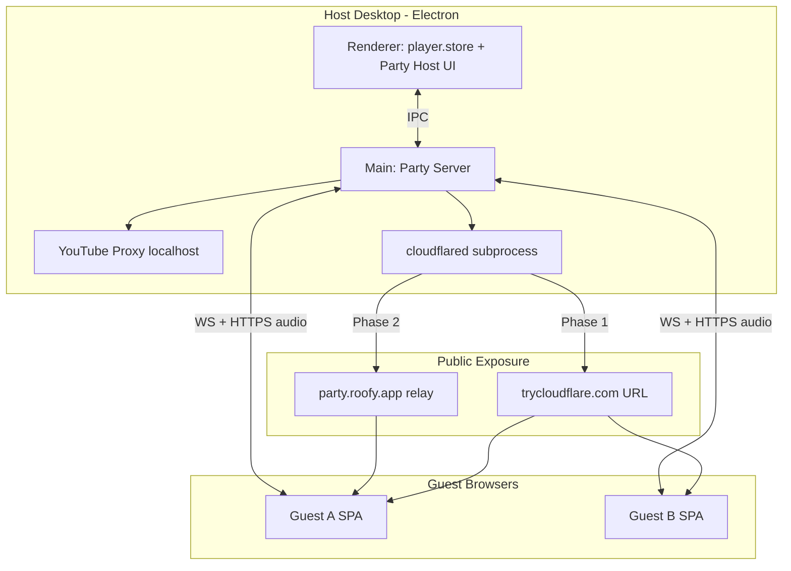
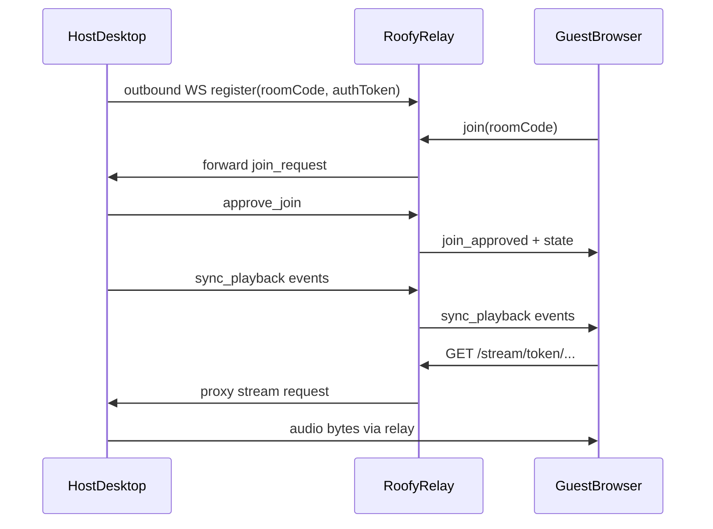

# Roofy Party Room — Full Spec Plan

## Vision

A **Party Room** is a host-controlled listening session where:

- The **desktop user** is the DJ/admin — playback runs on their machine (authoritative queue + player).
- **Friends join via browser** with a shareable link and short room code — no app install required.
- **Everyone hears the same thing in sync** (HTML5 audio in the guest browser, synced over WebSocket).
- **Guests contribute** by pasting YouTube/YouTube Music links or searching; the host approves (or auto-approves) before tracks enter the queue.
- **Public reach** is solved in two phases: built-in tunnel first, Roofy relay later.

This is distinct from the existing **Remote Control** feature ([`desktop/src/main/features/core/remote/index.ts`](roofy-music/desktop/src/main/features/core/remote/index.ts)), which is a single-controller, localhost-only mirror with no rooms, roles, or queue collaboration. Party Room **extends the same HTTP+WS patterns** but adds room semantics, guest UX, and public exposure.

Mobile **Listen Together** ([`roofy-music-mobile/metroproto/listentogether.proto`](roofy-music-mobile/metroproto/listentogether.proto)) is a useful reference for sync/buffer logic, but desktop Party Room should use a **JSON WebSocket protocol** (web-friendly) rather than protobuf — with optional MetroServer bridge in a later phase for Android interoperability.

---

## Architecture



### Authority model

| Layer | Source of truth |
|-------|-----------------|
| Playback (play/pause/seek/skip) | Host desktop player ([`player.store.ts`](roofy-music/desktop/src/renderer/store/player.store.ts)) |
| Queue order & contents | Host player store, mirrored to room state |
| Room membership & roles | Main-process `RoomManager` |
| Stream URLs | Host YouTube proxy ([`youtube-music/index.ts`](roofy-music/desktop/src/main/features/core/youtube-music/index.ts)) re-exposed through party HTTP with signed tokens |
| Sync clock | Party server stamps `serverTime` on PLAY events (pattern from mobile `ListenTogetherManager`) |

---

## Roles & Permissions

| Role | Who | Capabilities |
|------|-----|--------------|
| **Host** | Room creator (desktop) | Full playback control; approve/reject joins; approve/reject suggestions; reorder/remove queue items; kick/promote guests; end room; configure party settings |
| **CoDJ** (optional, v1.1) | Promoted guest | Approve suggestions; skip tracks; cannot kick host or change party settings |
| **Guest** | Browser joiner | Listen synced; suggest tracks (URL/search); upvote queue items; adjust local volume only; leave room |
| **Spectator** (optional setting) | Guest with listen-only | No suggestions, no votes |

Default: join requires host approval (matches mobile Listen Together UX).

---

## User Flows

### Host: Start a party

1. User opens **Party** panel (player bar or sidebar entry point).
2. Clicks **Start Party** → main process:
   - Generates 6-char room code (e.g. `ROOF42`, Crockford base32, no ambiguous chars).
   - Generates room secret + host session token.
   - Starts party HTTP+WS server (separate port from remote, e.g. `4334`).
   - Starts Cloudflare Quick Tunnel → returns public URL.
3. Desktop shows:
   - Share link: `https://<tunnel>/party/ROOF42`
   - Room code + QR code
   - Copy/share buttons (system share sheet on supported OS)
4. Host's normal player becomes **party-aware**: local controls remain; state broadcasts to room.

### Guest: Join via link

1. Opens link → guest SPA loads at `/party/:code` (code pre-filled).
2. Enters display name → `join_room` over WebSocket.
3. Host sees pending join request → approve/reject (or auto-approve if enabled).
4. On approval, guest receives full `RoomState` + signed stream URL for current track.
5. Guest `<audio>` element syncs via WS events; sends `buffer_ready` on track load.

### Guest: Add a song

1. Guest pastes `https://music.youtube.com/watch?v=...` or searches (lightweight search API proxied through host).
2. Sends `suggest_track` with URL or resolved metadata.
3. Host sees suggestion card → Approve / Reject / Approve & play next.
4. On approve, host renderer calls existing `addToQueueByType()` → party server broadcasts `queue_updated`.

---

## Protocol Design

New shared types in [`desktop/src/shared/types/party-types.ts`](roofy-music/desktop/src/shared/types/party-types.ts) (new file).

### Transport

- WebSocket at `/party/ws` (JSON messages, `{ type, payload, serverTime? }`).
- HTTP serves guest SPA + authenticated media routes.
- Reuse ping/pong + reconnect pattern from remote module (10s heartbeat).

### Core payloads

```typescript
// Illustrative — not final API
interface RoomState {
  code: string;
  hostName: string;
  nowPlaying: PartyTrack | null;
  isPlaying: boolean;
  positionMs: number;
  lastUpdateMs: number;
  queue: PartyTrack[];       // upcoming only (not full player store dump)
  guests: PartyGuest[];
  settings: PartySettings;
}

interface PartyTrack {
  id: string;                // stable room-scoped id
  sourceId: string;          // YouTube videoId or library track id
  source: 'youtube' | 'library';
  title: string;
  artist: string;
  album?: string;
  durationMs: number;
  artworkUrl: string;
  suggestedBy?: string;
  votes: number;
}
```

### Message types

**Client → Server**

| Type | Sender | Purpose |
|------|--------|---------|
| `create_room` | Host (via IPC, not WS) | Initialize room |
| `join_room` | Guest | `{ code, displayName }` |
| `leave_room` | Anyone | Disconnect cleanly |
| `approve_join` / `reject_join` | Host | Gate entry |
| `playback_action` | Host | `play`, `pause`, `seek`, `skip_next`, `skip_prev`, `change_track` |
| `queue_action` | Host | `add`, `remove`, `reorder`, `clear`, `approve_suggestion` |
| `suggest_track` | Guest | URL, search result id, or metadata |
| `vote_track` | Guest | Upvote queued/suggested item |
| `buffer_ready` | Guest | `{ trackId }` — ready to play after track change |
| `request_sync` | Guest | Full state snapshot |
| `reconnect` | Anyone | `{ sessionToken }` |
| `kick_guest` / `promote_codj` | Host | Moderation |

**Server → Client**

| Type | Purpose |
|------|---------|
| `room_created` | Host IPC callback with code, link, tokens |
| `join_pending` | Guest waiting for approval |
| `join_approved` / `join_rejected` | Admission result |
| `room_state` | Full snapshot |
| `sync_playback` | Play/pause/seek/skip broadcast |
| `queue_updated` | Queue diff or full upcoming list |
| `suggestion_received` | Host notification |
| `suggestion_resolved` | Guest notified of outcome |
| `buffer_wait` / `buffer_complete` | Coordinated track start (port from mobile) |
| `guest_joined` / `guest_left` | Roster updates |
| `kicked` / `room_ended` | Session termination |
| `error` | `{ code, message }` |

### Sync engine (port from mobile)

Key behaviors from [`ListenTogetherManager.kt`](roofy-music-mobile/app/src/main/kotlin/com/metrolist/music/listentogether/ListenTogetherManager.kt):

- On track change: host sends `change_track` → guests load audio → each sends `buffer_ready` → server emits `buffer_complete` → host sends `play` with `serverTime`.
- Position drift correction on guests: `adjustedPos = positionMs + (Date.now() - serverTime)`.
- Debounce seeks (1s) and position tolerance (2s) to avoid choppy playback.
- Host heartbeat every 8s while playing.
- Guest audio controls disabled except local volume; transport is host-only.

---

## Public URL Strategy (phased)

### Phase 1 — Built-in Cloudflare Quick Tunnel (MVP)

- Main process spawns `cloudflared` (bundled binary in [`desktop/resources/bin/`](roofy-music/desktop/resources/bin/) alongside Navidrome pattern).
- Command: `cloudflared tunnel --url http://127.0.0.1:<partyPort>`
- Returns ephemeral URL like `https://abc-def.trycloudflare.com`.
- Share link = `{publicUrl}/party/{code}`.
- **Pros**: Zero Roofy backend, works through NAT/firewalls, HTTPS out of the box.
- **Cons**: URL changes each session; tunnel dies when host closes app; bandwidth through host.

Fallback when tunnel fails: bind party server to `0.0.0.0` and show LAN URL (`http://192.168.x.x:4334/party/ROOF42`) for same-network parties.

### Phase 2 — Roofy Relay Service

Separate lightweight service (Node/Go):

- Guest connects to `wss://party.roofy.app/r/{code}`.
- Relay forwards WS + proxies HTTP media to host via outbound WebSocket tunnel (host initiates connection — no port forwarding needed).
- Stable URLs: `https://party.roofy.app/join/ROOF42`.
- Optional: account-linked persistent host identity, room history, moderation.



---

## Media & Track Resolution

### Supported sources (MVP)

1. **YouTube / YouTube Music URLs** — resolved via existing main-process YouTube layer (`youtube-music:resolve` IPC wrapper around existing import/metadata logic).
2. **Local library tracks (Navidrome)** — host-only initially; guests receive proxied stream from host's local server (Subsonic `stream` endpoint tunneled through party HTTP with auth token). Phase 1.1.

### Stream delivery to guests

Problem: current yt-proxy URLs are `http://127.0.0.1:{port}/yt-stream/{videoId}` — unreachable from internet.

Solution: Party HTTP server exposes authenticated routes:

- `GET /party/api/stream/:trackId?token=<signed JWT>`
- Token encodes: roomCode, guestSessionId, trackId, expiry (5 min, refreshed on track change).
- Handler proxies to localhost yt-proxy or Navidrome stream.
- Rate-limit per guest; max concurrent streams = guest count.

Reuse image proxy pattern from remote module (`/party/api/artwork/:id`).

---

## Code Structure

```
desktop/src/main/features/core/party/
  index.ts              # IPC handlers, lifecycle, shutdown
  party-server.ts       # HTTP + WS (fork patterns from remote/index.ts)
  room-manager.ts       # Room state, roles, sessions, codes
  sync-coordinator.ts   # Buffer gate, serverTime, broadcast
  tunnel/
    cloudflare.ts       # Phase 1: spawn cloudflared, parse URL
    relay-client.ts     # Phase 2: outbound relay connection
  track-resolver.ts     # URL → PartyTrack via youtube-music IPC
  stream-auth.ts        # Signed tokens for guest media access

desktop/src/party/                    # Guest web SPA (Vite entry, like src/remote/)
  index.html, index.tsx, app.tsx
  components/
    join-screen.tsx
    now-playing.tsx
    queue-list.tsx
    suggest-track.tsx
    guest-roster.tsx          # host-only view in desktop, not guest SPA

desktop/src/renderer/features/party/
  hooks/use-party-host.ts     # Bridge player.store ↔ party IPC
  components/party-panel.tsx  # Share link, QR, pending joins/suggestions
  components/party-settings.tsx

desktop/src/shared/types/party-types.ts
desktop/src/preload/index.ts          # window.api.party.*
```

### Integration points (existing code)

| Existing | Party usage |
|----------|-------------|
| [`remote/index.ts`](roofy-music/desktop/src/main/features/core/remote/index.ts) | HTTP static serving, WS broadcast, Basic auth patterns, graceful shutdown |
| [`use-remote.tsx`](roofy-music/desktop/src/renderer/features/remote/hooks/use-remote.tsx) | Pattern for player events → main broadcast |
| [`player.store.ts`](roofy-music/desktop/src/renderer/store/player.store.ts) | `addToQueueByType`, `mediaPlay/Pause/Seek`, queue subscription |
| [`youtube-music/index.ts`](roofy-music/desktop/src/main/features/core/youtube-music/index.ts) | Metadata + stream proxy |
| [`settings.store.ts`](roofy-music/desktop/src/renderer/store/settings.store.ts) | New `party` settings section |

### Host bridge hook

`use-party-host.ts` subscribes to player store changes (same pattern as `use-remote.tsx`):

```
player.store change → window.api.party.broadcastState(...)
guest WS message → IPC → usePlayerActions().mediaNext() / addToQueueByType() / etc.
```

Add `partyMode: boolean` guard on player store to prevent conflicting local edits during party (optional lock toggle).

---

## Guest Browser App (UX spec)

Mobile-first SPA, minimal bundle (~same footprint as [`src/remote/`](roofy-music/desktop/src/remote/)).

### Screens

1. **Join** — display name, room code field (pre-filled from URL), "Join party" CTA, connection status.
2. **Listening** — large artwork, track title/artist, progress bar (read-only), synced playback indicator, local volume slider.
3. **Queue** — now playing + up next; vote buttons on items; "Suggested by @name" badges.
4. **Add song** — paste URL field + optional lightweight search; submission shows "Pending approval" state.
5. **Error/Ended** — room closed, kicked, or connection lost with reconnect button.

### Delight features (v1.1+)

- Emoji reactions floating on now-playing art
- "Vote to skip" (threshold-based, host configurable)
- Guest avatar colors from hashed display name
- Party theme tint pulled from album art dominant color

---

## Host Desktop UI (UX spec)

### Party panel (persistent while room active)

- **Status strip**: LIVE indicator, guest count, tunnel status (connected / reconnecting).
- **Share card**: public link, room code, QR, copy buttons.
- **Pending joins**: approve/reject list with avatars.
- **Pending suggestions**: track preview + Approve / Play next / Reject.
- **Guest list**: kick, promote to Co-DJ, mute suggestions.
- **Settings gear**: auto-approve joins, auto-approve suggestions, max guests (default 20), vote-to-skip threshold, allow library tracks.

### Entry points

- Player bar "Party" button (disabled if no playable source configured).
- Settings → Party → default preferences.
- Optional: "Start party" in queue context menu.

---

## Security & Abuse Prevention

| Concern | Mitigation |
|---------|------------|
| Unauthorized room access | 6-char code (~32^6 entropy) + optional PIN; join approval default |
| Stream URL leaking | Short-lived signed JWT per guest+track; no raw localhost URLs in WS |
| Guest spam | Rate limit suggestions (1 per 30s), max queue size (100) |
| Credential exposure | All YouTube/Navidrome auth stays in main process; guests never see cookies |
| Host impersonation | Host session token issued only via Electron IPC, never via guest WS |
| Tunnel MITM | HTTPS only; show "verify host identity" hint (display host name) |
| Legal/bandwidth | Host streams to N guests through their uplink — show bandwidth warning for 5+ guests |

---

## Settings Schema

Add to [`settings.store.ts`](roofy-music/desktop/src/renderer/store/settings.store.ts):

```typescript
party: {
  defaultDisplayName: string;       // host name shown to guests
  autoApproveJoins: boolean;        // default false
  autoApproveSuggestions: boolean;  // default false
  maxGuests: number;                // default 20
  voteToSkipEnabled: boolean;
  voteToSkipThreshold: number;      // e.g. 50% of guests
  allowLibraryTracks: boolean;
  exposureMode: 'tunnel' | 'lan' | 'relay';  // phase-dependent
  relayToken?: string;              // phase 2
}
```

---

## Delivery Phases

### Phase 0 — Foundation (1–2 weeks)

- `party-types.ts`, `RoomManager`, `PartyServer` (localhost only, LAN bind)
- Guest SPA skeleton: join + static now-playing
- Host panel: create/end room, share LAN link
- Wire host player events → broadcast (no guest audio yet)

### Phase 1 — MVP Party (2–3 weeks)

- Cloudflare Quick Tunnel integration
- Guest synced audio playback + buffer protocol
- Suggest track via URL; host approve/reject
- Queue sync (upcoming tracks visible to guests)
- Join approval flow + session reconnect (10 min grace)

### Phase 1.1 — DJ polish (1–2 weeks)

- Vote on queue items; vote-to-skip
- Lightweight search for guests (proxy host search)
- QR code, copy link, guest count badge in player bar
- Local library track support through host stream proxy

### Phase 2 — Roofy Relay (2–4 weeks, separate service)

- Outbound relay protocol (host-initiated)
- Stable public URLs
- Relay health monitoring in host UI
- Optional authenticated host accounts

### Phase 3 — Cross-platform (future)

- Bridge to mobile Listen Together MetroServer protocol so Android guests can join desktop-hosted rooms (or vice versa)
- Shared `listentogether.proto` subset for sync messages

---

## Testing Plan

| Area | Tests |
|------|-------|
| Room lifecycle | Create, join, approve, reject, leave, end, reconnect within grace period |
| Sync | Track change buffer gate; seek drift < 500ms after 5 min playback |
| Queue | Suggest → approve → appears in host player + guest queue view |
| Security | Expired stream tokens rejected; guest cannot send `playback_action` |
| Tunnel | cloudflared spawn/kill; fallback to LAN URL on failure |
| Load | 10 simultaneous guests; measure host CPU/bandwidth |

Manual QA matrix: Chrome/Safari/Firefox mobile + desktop; host on Windows/macOS/Linux.

---

## Key Risks & Mitigations

| Risk | Mitigation |
|------|------------|
| Host uplink bandwidth (N × stream) | Compress where possible; warn at 5+ guests; future: guests stream directly from YouTube with sync-only WS (higher drift) |
| cloudflared not installed/blocked | Bundle binary; LAN fallback; clear error UI |
| YouTube ToS / rate limits | Host-only resolution; cache metadata; reuse existing proxy caching |
| Sync drift on mobile browsers | `serverTime` correction + periodic `request_sync` on visibility change |
| Conflict with existing Remote feature | Separate port, separate toggle; Remote stays localhost personal control |

---

## Recommendation Summary

**Best approach**: Build a new **Party Server module** in the Electron main process that reuses remote infrastructure patterns, pairs with a dedicated **guest SPA** (`src/party/`), and connects the host through **`use-party-host`** to the existing player store. Ship **Cloudflare Quick Tunnel** for instant public links; add **Roofy Relay** for stable URLs. Port sync/buffer semantics from mobile Listen Together but keep a **JSON protocol** tailored for web guests and desktop-as-host DJ control.

This gives you the "expose my session with a link and code" experience without waiting on external MetroServer changes, while leaving a clean path to mobile interoperability later.
