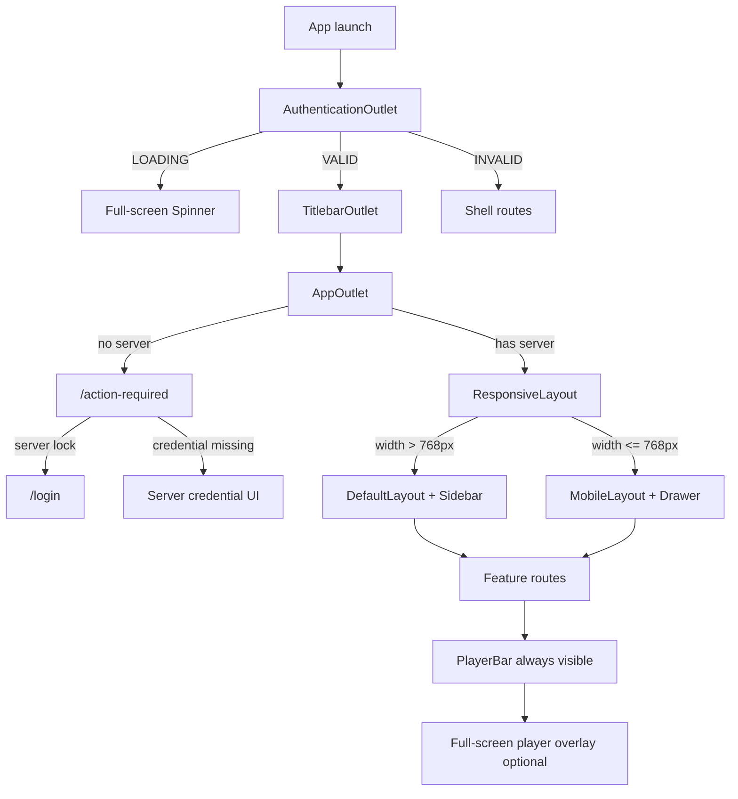

# Product UX/UI Specification

**Repository:** `roofy-music` (desktop Electron app under `desktop/`)  
**Document scope:** Desktop/web renderer UI only. Android is described in README as a future direction but has no UI implementation in this repo.  
**Last audited from code:** 2026-06-01  
**Method:** File-level audit of routing, layouts, features, stores, themes, modals, and navigation. Uncertainties are marked `Unclear from code`.

---

## 1. Overview

### App purpose

Roofy Music is a **local-first personal music application** forked from Feishin. It connects to a music library server (primarily **Navidrome** via a bundled local sidecar, also Jellyfin and other Subsonic-compatible servers), provides desktop-style browsing and playback, playlists, search, stats, optional **YouTube Music** integration (Electron), user-initiated imports via `yt-dlp`/`ffmpeg`, device handoff, and a **Party** (listen-together) mode.

### Main user types (identifiable from code)

| User type | Evidence |
| --------- | -------- |
| **Local Roofy user** | Server lock + `ServerType.NAVIDROME`; auto-login via `window.api.localFirst.credentials()`; **Roofy Local** settings in Advanced → Local tab. |
| **Self-hosted server user** | Multi-server list, login route, `ServerList` modal, command palette **Manage servers**. |
| **Jellyfin user** | `ServerType.JELLYFIN` changes home carousels (songs vs albums for most-played/recent). |
| **YouTube Music user** | Electron-only sidebar accordion + `/youtube-music` route; account button in sidebar. |
| **Party host / guest** | `/party` route; `PartySetupScreen` vs `PartyDashboardGrid` (sidebar item **disabled by default**). |
| **Remote controller** | Separate PWA at `desktop/src/remote/` for LAN remote playback control. |

### Main functional areas

- **Home & discovery** — configurable carousels, featured genres, YouTube Music home carousels.
- **Library** — albums, tracks, album artists, artists, genres, folders, playlists, radio, favorites.
- **Search** — dedicated search route per item type + global command palette.
- **Playback** — persistent player bar, full-screen player, side queue, now-playing page, visualizers, lyrics.
- **Imports & offline** — `/imports` download queue; offline filter on songs (`?offline=1`); local import jobs in settings.
- **Settings** — general, playback, downloads, appearance, Discord, devices, advanced (local engine, hotkeys).
- **Stats** — listening analytics (`StatsContent`).
- **Party** — collaborative listening room (Electron feature area).

### Main navigation model

- **HashRouter** (`#/…`) with nested outlets: `AuthenticationOutlet` → `TitlebarOutlet` → `AppOutlet` → `ResponsiveLayout` → route.
- **Desktop:** resizable left sidebar (nav + playlists), main content, optional right **side queue**, bottom **player bar**; retro theme adds top/status bars.
- **Mobile (≤768px):** hamburger **Drawer** sidebar, compact player bar, full-screen mobile player overlay.
- **Global overlays:** command palette modal, Mantine context modals, full-screen player/visualizer, context menus, toasts, import notifications, release notes, update dialog.
- **Auth gate:** `AppOutlet` redirects to `/action-required` when no `currentServer`; `useServerAuthenticated` shows loading spinner then validates credentials.

### Platforms supported

| Platform | Supported |
| -------- | --------- |
| **Electron desktop** (Windows, macOS, Linux) | Yes — primary; `isElectron()` gates YTM, downloads settings, local tab, Discord, devices tabs. |
| **Web** | Partial — renderer runs; forced `PlayerType.WEB`; no Electron-only settings tabs; custom web titlebar when `Platform.WEB`. |
| **Mobile web (narrow viewport)** | Yes — `useIsMobile()` at 768px switches to `MobileLayout`. |
| **Remote PWA** | Yes — `desktop/src/remote/` minimal player shell. |
| **Android native** | Not in this repo (`README.md` future direction). |

---

## 2. App Architecture Relevant to UX

| Area | File/Folder | Purpose |
| ---- | ----------- | ------- |
| Renderer entry | `roofy-music/desktop/src/renderer/app.tsx` | Mantine provider, theme, `AppRouter`, player providers, global notifications, import/update/release-notes overlays. |
| Main process | `roofy-music/desktop/src/main/` | Electron window, menus, MPRIS, IPC (`window.api`), local Navidrome sidecar. `Unclear from code` without full main-process audit. |
| Routing enum | `roofy-music/desktop/src/renderer/router/routes.ts` | `AppRoute` path constants. |
| Route tree | `roofy-music/desktop/src/renderer/router/app-router.tsx` | Lazy routes, `ModalsProvider`, shell vs authenticated branches. |
| Auth shell | `roofy-music/desktop/src/renderer/layouts/authentication-outlet.tsx` | Loading spinner during server auth. |
| Server gate | `roofy-music/desktop/src/renderer/router/app-outlet.tsx` | Redirect to action-required if no server / lock mismatch. |
| Responsive shell | `roofy-music/desktop/src/renderer/layouts/responsive-layout.tsx` | Desktop vs mobile layout, command palette, hotkeys, GC. |
| Desktop layout | `roofy-music/desktop/src/renderer/layouts/default-layout.tsx` | Window bar, retro bars, main content, player bar, context menu root. |
| Mobile layout | `roofy-music/desktop/src/renderer/layouts/mobile-layout/mobile-layout.tsx` | Drawer sidebar, mobile fullscreen player. |
| Feature screens | `roofy-music/desktop/src/renderer/features/**` | Route components and feature UI. |
| Shared UI | `roofy-music/desktop/src/shared/components/**` | Mantine-wrapped design system primitives. |
| Item lists | `roofy-music/desktop/src/renderer/components/item-list/**` | Tables, grids, carousels for library entities. |
| Themes | `roofy-music/desktop/src/shared/themes/**`, `renderer/themes/use-app-theme.ts` | 30+ color themes + **Retro Monochrome**. |
| Auth / servers | `roofy-music/desktop/src/renderer/store/auth.store.ts` (via `useAuthStore`) | Server list, current server, credentials. |
| Settings UI state | `roofy-music/desktop/src/renderer/store/settings.store.ts` | Sidebar order, list display, player, hotkeys, home sections. |
| Player state | `roofy-music/desktop/src/renderer/store/player.store.ts` | Queue, playback status, current song. |
| App chrome state | `roofy-music/desktop/src/renderer/store/app.store.ts` | Sidebar widths, command palette, expanded list. |
| Product UX copy/errors | `roofy-music/desktop/src/shared/product-ux/**` | Toasts, empty states, track menu visibility, import copy. |
| i18n | `roofy-music/desktop/src/i18n/` | `react-i18next` strings for labels and errors. |
| Remote UI | `roofy-music/desktop/src/remote/` | Lightweight remote control web app. |
| Party (shared) | `roofy-music/desktop/src/party/` | Party room logic used by party route. |

---

## 3. Route Map / Screen Map

Hash routes (e.g. `index.html#/library/albums`). `*` = catch-all inside authenticated layout.

| Route / Entry Point | Screen Name | Component/File | Auth Required | Notes |
| ------------------- | ----------- | -------------- | ------------- | ----- |
| `/` (index) | Home | `features/home/routes/home-route.tsx` | Yes (server) | Default landing after auth. |
| `/local` | Roofy Local (redirect) | `features/local-first/routes/local-first-route.tsx` | Yes | **Redirects** to `/settings` with `tab: advanced` (spinner only). |
| `/search/:itemType` | Search | `features/search/routes/search-route.tsx` | Yes | `itemType` = library entity type (e.g. song). |
| `/favorites` | Favorites | `features/favorites/routes/favorites-route.tsx` | Yes | Query `?type=` for album / song / album-artist. |
| `/settings` | Settings | `features/settings/routes/settings-route.tsx` | Yes | Tab state in settings store. |
| `/stats` | Stats | `features/stats/routes/stats-route.tsx` | Yes | Wraps `StatsContent`. |
| `/imports` | Imports / downloads | `features/imports/routes/imports-route.tsx` | Yes | **Not** in default sidebar; linked from retro top bar, song list header. |
| `/youtube-music` | YouTube Music | `features/youtube-music/routes/youtube-music-route.tsx` | Yes | Electron; `?view=browse\|search\|songs\|playlists\|login`, `?q=`, `?playlist=`. |
| `/now-playing` | Now Playing (queue page) | `features/now-playing/routes/now-playing-route.tsx` | Yes | Collapses right sidebar on enter. |
| `/party` | Party | `features/party/routes/party-route.tsx` | Yes | Sidebar entry **disabled** in defaults. |
| `/library/genres` | Genres list | `features/genres/routes/genre-list-route.tsx` | Yes | Nested index under genres path. |
| `/library/genres/:genreId` | Genre detail | `features/genres/routes/genre-detail-route.tsx` | Yes | |
| `/library/albums` | Albums list | `features/albums/routes/album-list-route.tsx` | Yes | Shared list pattern. |
| `/library/albums/:albumId` | Album detail | `features/albums/routes/album-detail-route.tsx` | Yes | YTM placeholder if YouTube entity id. |
| `/library/albums/dummy/:albumId` | Dummy album detail | `features/albums/routes/dummy-album-detail-route.tsx` | Yes | `Unclear from code` which UI links here without further trace. |
| `/library/songs` | Tracks list | `features/songs/routes/song-list-route.tsx` | Yes | Supports `?offline=1`. |
| `/library/folders` | Folders list | `features/folders/routes/folder-list-route.tsx` | Yes | |
| `/library/artists` | Artists list | `features/artists/routes/artist-list-route.tsx` | Yes | |
| `/library/artists/:artistId` | Artist detail | `features/artists/routes/album-artist-detail-route.tsx` | Yes | Nested child routes below. |
| `/library/artists/:artistId/discography` | Artist discography | `album-list-route.tsx` | Yes | |
| `/library/artists/:artistId/songs` | Artist songs | `song-list-route.tsx` | Yes | |
| `/library/artists/:artistId/top-songs` | Artist top songs | `album-artist-detail-top-songs-list-route.tsx` | Yes | |
| `/library/artists/:artistId/favorite-songs` | Artist favorite songs | `album-artist-detail-favorite-songs-list-route.tsx` | Yes | |
| `/library/album-artists` | Album artists list | `features/artists/routes/album-artist-list-route.tsx` | Yes | |
| `/library/album-artists/:albumArtistId` | Album artist detail | `album-artist-detail-route.tsx` | Yes | Same nested children as artist. |
| `/playlists` | Playlists list | `features/playlists/routes/playlist-list-route.tsx` | Yes | Default sidebar item **disabled**. |
| `/playlists/:playlistId/songs` | Playlist detail | `features/playlists/routes/playlist-detail-song-list-route.tsx` | Yes | |
| `/radio` | Radio stations | `features/radio/routes/radio-list-route.tsx` | Yes | |
| `*` (authenticated) | Invalid / unknown route | `features/action-required/routes/invalid-route.tsx` | Yes | Shows path + back. |
| `/action-required` | Action required | `features/action-required/routes/action-required-route.tsx` | No | Server/credential setup; may embed `LoginRoute`. |
| `/login` | Login | `features/login/routes/login-route.tsx` | No | Server-lock login; auto Navidrome bootstrap. |
| `/no-network` | No network | `features/action-required/routes/no-network-route.tsx` | Partial | Shown when auth fails after network retries. |
| `/explore` | — | — | — | **Defined in `AppRoute` but not registered** in `app-router.tsx`. |
| `/playing` | — | — | — | **Defined but not registered.** |
| `/servers` | — | — | — | **Defined but not registered**; server management via modals/command palette. |

---

## 4. Global Navigation Model

### Top-level navigation

1. **Left sidebar** (`features/sidebar/components/sidebar.tsx`): Home → primary items (Search, Now Playing, Settings) → accordion **My Library** → accordion **Online** (YouTube Music, Electron only) → Collections → Playlists (if enabled in settings).
2. **Action bar** (top of sidebar): read-only search field opens **command palette**; app menu dropdown; back/forward.
3. **Player bar** (bottom): transport, volume, queue toggle, link to Now Playing; opens full-screen player when drawer mode enabled.
4. **Right sidebar** (desktop): collapsible **play queue** (`SidebarPlayQueue`) when `sideQueueType === 'sideQueue'`.
5. **Command palette** (global hotkey): search, go-to commands, server management, YTM section.
6. **Context menus** (right-click): entity-specific actions on library items and queue.

### Back behavior

- Sidebar action bar: `navigate(-1)` / `navigate(1)`.
- Hotkeys: `browserBack` / `browserForward` in `responsive-layout.tsx`.
- Invalid route: back `ActionIcon`.

### Deep links

- Hash URLs for all `AppRoute` paths.
- Search route may receive `location.state.navigationId`.
- YouTube Music uses query params for sub-views.

### Conditional navigation

| Condition | Behavior |
| --------- | -------- |
| No `currentServer` | `AppOutlet` → `/action-required`. |
| Server lock URL mismatch | Deletes server, redirects action-required. |
| `isServerLock()` && no server | `ActionRequiredRoute` renders `LoginRoute`. |
| Auth network failure | `useServerAuthenticated` → `/no-network`. |
| `isElectron()` false | Hides downloads/appearance/discord/devices settings tabs. |
| `useIsMobile()` true | `MobileLayout` + drawer. |
| Retro theme | Extra top bar (imports link) + status bar. |

---

## 5. Screen-by-Screen Documentation

> **List screen pattern:** Albums, Tracks, Artists, Album Artists, Genres (list), Folders, Playlists, and Radio share `LibraryContainer` + `PageHeader` / `LibraryHeaderBar` + filters + infinite table or grid (`song-list-*`, `album-list-*`, etc.). States: React Query loading/error, `ProductUxEmptyState`, pagination/infinite scroll per settings.

---

## Screen: Home

### Purpose

Personalized landing: YouTube Music carousels (if Electron), local library carousels (recently added, played, released, random, most played), optional featured genres and feature albums.

### Source Files

- `features/home/routes/home-route.tsx`
- `features/home/components/*` (carousels)
- `features/youtube-music/components/youtube-music-home-carousels.tsx`
- `store/settings.store.ts` (`homeItems`, `homeFeature`)

### Entry Points

- Sidebar **Home**; hotkey `navigateHome`; command palette; post-login redirect.

### Exit Points

- Carousel items → album/song detail routes; genre section → genre detail.

### Layout Structure

Scrollable `NativeScrollArea` → stacked carousels with section titles.

### UI Elements

| Element | Type | Purpose | User Interaction | Result |
| ------- | ---- | ------- | ---------------- | ------ |
| YTM carousels | Carousel rows | Online discovery | Click item | Play / navigate per carousel handler |
| Local library heading | Text | Section label | — | — |
| Feature carousel | Album carousel | Highlight albums | Click | Album detail |
| Home carousels | Album/song carousels | Configurable shelves | Refresh icon | Refetch query |
| Featured genres | Genre grid | Browse genres | Click | Genre detail |

### States

| State | When | What user sees | File/Logic |
| ----- | ---- | -------------- | ---------- |
| Loading | Suspense / queries | `Spinner` | Route boundary |
| Empty carousel | No results | Empty carousel UI | Per carousel component |
| Jellyfin vs Navidrome | `ServerType` | Different item types in carousels | `home-route.tsx` |

### Data Dependencies

| Dependency | Purpose | File |
| ---------- | ------- | ---- |
| `useHomeItems` | Which sections show | settings store |
| `useCurrentServer` | Jellyfin detection | auth store |
| React Query | Carousel data | album/song API queries |

### Responsive Behavior

Extra top padding when `Platform.WEB` window bar.

### UX Notes

- YouTube section appears above local library heading on home (may imply online-first hierarchy).
- Disabled home sections hidden via `homeItems.filter(!disabled)`.

### Open Questions

- `Unclear from code` default theme on first run.

---

## Screen: Settings

### Purpose

Configure playback, appearance, downloads, Discord RPC, devices, local Navidrome/import tools, hotkeys, cache, updates.

### Source Files

- `features/settings/routes/settings-route.tsx`
- `features/settings/components/settings-content.tsx`
- Tab folders: `general/`, `playback/`, `appearance/`, `downloads/`, `discord/`, `devices/`, `advanced/`
- `features/settings/components/settings-modal.tsx` (modal variant)

### Entry Points

- Sidebar **Settings**; `/local` redirect; settings modal from header.

### Exit Points

- Stays in app shell; tab changes via store only.

### Layout Structure

Horizontal tabs → lazy-loaded panel content in scrollable container (`min(76vh, 54rem)`).

### UI Elements

| Element | Type | Purpose | User Interaction | Result |
| ------- | ---- | ------- | ---------------- | ------ |
| Tabs | Tabs | Section switch | Click tab | `setSettings({ tab })` |
| GeneralTab | Form sections | Language, sidebar order, home sections, etc. | Various | Persisted settings |
| LocalTab | Advanced (Electron) | Navidrome status, import, pairing | Forms/buttons | IPC `window.api.localFirst` |
| DownloadsSettingsTab | Electron | Offline/download prefs | Toggles/inputs | Settings store |
| HotkeysTab | Advanced | Keyboard shortcuts | Key capture | settings store |

### States

| State | When | What user sees | File/Logic |
| ----- | ---- | -------------- | ---------- |
| Tab hidden | Not Electron | downloads/appearance/discord/devices absent | `settings-content.tsx` |
| Legacy tab ids remapped | `tab=window\|hotkeys\|local` | Maps to appearance/advanced | `resolveSettingsTab` |

### Data Dependencies

| Dependency | Purpose | File |
| ---------- | ------- | ---- |
| `useSettingsStore` | Tab + all prefs | settings.store.ts |
| `window.api` | Local engine | Electron preload |

### UX Notes

- **Roofy Local** is not a standalone page; `/local` redirects here (Advanced).
- Local tab is large (engine, imports, Spotify/Soundcloud, phone link).

### Open Questions

- `Unclear from code` full inventory of every GeneralTab field without line-by-line read.

---

## Screen: YouTube Music

### Purpose

Browse/search/import from connected YouTube Music account (Electron IPC).

### Source Files

- `features/youtube-music/routes/youtube-music-route.tsx`
- Components: `youtube-music-songs-table.tsx`, `youtube-music-playlist-detail.tsx`, `youtube-music-account-button.tsx`

### Entry Points

- Sidebar **Online** accordion links (`?view=browse|search|songs|playlists`).
- Home YTM carousels.

### Exit Points

- Play/add to queue; import jobs; account login flow (`view=login`).

### Layout Structure

`PageHeader` + `LibraryHeaderBar` + view-specific body (carousels, search input, tables, playlist detail).

### States

| State | When | What user sees | File/Logic |
| ----- | ---- | -------------- | ---------- |
| Not connected | `!status.connected` | Login/connect prompts | status from `window.api.youtubeMusic.status()` |
| Search loading | React Query | Spinner | `searchQuery` |
| Disconnected view | `view=login` | Auth UI | route branches |

### Data Dependencies

| Dependency | Purpose | File |
| ---------- | ------- | ---- |
| `window.api.youtubeMusic` | All YTM operations | Electron main |
| `useImportJobActions` | Import queue | import jobs store |

### UX Notes

- Hidden entirely on non-Electron builds (sidebar accordion not rendered).

---

## Screen: Now Playing

### Purpose

Full-page play queue with search/filter and list controls.

### Source Files

- `features/now-playing/routes/now-playing-route.tsx`
- `features/now-playing/components/play-queue.tsx`, `now-playing-header.tsx`

### Entry Points

- Sidebar **Now Playing**; player bar navigation.

### Exit Points

- Song context menu; other routes via sidebar.

### Layout Structure

Header → list controls → queue table.

### States

| State | When | What user sees | File/Logic |
| ----- | ---- | -------------- | ---------- |
| Enter/exit | Route mount | Right sidebar forced collapsed/expanded | `useEffect` in route |

---

## Screen: Imports

### Purpose

View and manage download/import jobs; link to offline songs library.

### Source Files

- `features/imports/routes/imports-route.tsx`
- `features/imports/components/downloads-screen.tsx`
- Global `import-notifications.tsx` in `app.tsx`

### Entry Points

- Retro top bar **Imports** button; song list header button; **not** default sidebar.

### Exit Points

- Button → `/library/songs?offline=1`.

---

## Screen: Party

### Purpose

Host or join a collaborative listening session with DJ tools and guest grid.

### Source Files

- `features/party/routes/party-route.tsx`
- `party-setup-screen.tsx`, `party-dashboard-grid.tsx`, `party-dj-tools-bar.tsx`
- `desktop/src/party/party-app.tsx` (logic)

### Entry Points

- Manual navigation to `/party` (sidebar item disabled by default).

### States

| State | When | What user sees | File/Logic |
| ----- | ---- | -------------- | ---------- |
| Setup | `!state` | `PartySetupScreen` | party store |
| Active room | `state` | Header + grid + DJ bar | party store |
| Bandwidth warning | ≥5 guests | Toast | `party-route.tsx` |

---

## Screen: Login / Action Required / No Network

### Purpose

- **Login:** Authenticate to server-locked instance (esp. Navidrome auto-credentials).
- **Action required:** Pick server or enter credentials when missing.
- **No network:** Retry after auth network failure.

### Source Files

- `features/login/routes/login-route.tsx`
- `features/action-required/routes/action-required-route.tsx`
- `features/action-required/routes/no-network-route.tsx`
- `features/action-required/components/server-required.tsx`, `server-credential-required.tsx`

### States

| State | When | What user sees | File/Logic |
| ----- | ---- | -------------- | ---------- |
| Auto-connecting | Navidrome lock | Message + spinner | `LoginRoute` useEffect |
| Invalid server config | Bad env | JSON config error | `LoginRoute` |
| Manage servers | Credential required | Modal `ServerList` | `openModal` |

---

## Screen: Album / Artist / Genre / Playlist detail

### Purpose

Entity detail with artwork background, header actions (play, shuffle, favorite), and song/album lists.

### Source Files

- e.g. `album-detail-route.tsx`, `album-artist-detail-route.tsx`, `genre-detail-route.tsx`, `playlist-detail-song-list-route.tsx`
- Shared: `library-background-overlay`, `library-header-bar`, detail headers in `features/*/components/*-detail-header*`

### States

| State | When | What user sees | File/Logic |
| ----- | ---- | -------------- | ---------- |
| YTM album unavailable | `isYoutubeMusicEntityId` | Placeholder center message | `album-detail-route.tsx` |
| Loading | Suspense | Spinner | React Query suspense |

---

## Screen: Search (route)

### Purpose

Full-page search for a specific library item type with header and results sections.

### Source Files

- `features/search/routes/search-route.tsx`
- `features/search/components/search-content.tsx`, `search-header.tsx`

### Entry Points

- Sidebar Search → `/search/song` (default path from sidebar config).

---

## Screen: Favorites

### Purpose

Filtered library view of starred albums, songs, or album artists.

### Source Files

- `features/favorites/routes/favorites-route.tsx`
- `favorites-content.tsx`, `favorites-header.tsx`

### Entry Points

- Sidebar Favorites; query `?type=album|song|albumArtist`.

---

## Screen: Stats

### Purpose

Listening statistics and charts.

### Source Files

- `features/stats/routes/stats-route.tsx`
- `features/stats/components/stats-content.tsx`
- `features/stats/hooks/use-local-stats-tracker.ts`

---

## Screen: Remote (PWA)

### Purpose

Minimal remote control UI for playback from another device on the LAN.

### Source Files

- `desktop/src/remote/app.tsx`, `remote-container.tsx`, `index.html`

### Entry Points

- `Unclear from code` exact URL/port from desktop remote settings without reading `remote-settings.tsx` fully.

---

*Additional list screens (Albums, Tracks, Artists, Genres, Folders, Playlists, Radio) follow the shared list pattern documented in section 5 introduction.*

---

## 6. Shared Components Inventory

| Component | File | Used By | Purpose | Important Props/States |
| --------- | ---- | ------- | ------- | ---------------------- |
| `Button` | `shared/components/button/` | Global | Primary actions | `variant`, `loading`, `disabled` |
| `ActionIcon` | `shared/components/action-icon/` | Global | Icon buttons | `tooltip`, `icon` |
| `TextInput` / `PasswordInput` | `shared/components/text-input/` | Forms, search | Text entry | Mantine `variant` |
| `Modal` | `shared/components/modal/` | Command palette, confirms | Dialog shell | — |
| `Drawer` | `shared/components/drawer/` | Mobile sidebar | Slide-over | `opened`, `onClose` |
| `ContextMenu` | `shared/components/context-menu/` | Library items | Right-click menus | Radix-based |
| `Spinner` | `shared/components/spinner/` | Suspense fallbacks | Loading | `container` |
| `ProductUxEmptyState` | `shared/components/product-ux-empty-state.tsx` | Empty lists | i18n empty state | `titleKey`, `descriptionKey`, `role="status"` |
| `Tabs` | `shared/components/tabs/` | Settings | Tab panels | `keepMounted` |
| `Toast` | `shared/components/toast/` | Errors/success | Notifications | Mantine notifications wrapper |
| `ItemTableList` / grids | `renderer/components/item-list/` | Library lists | Tables & grids | Sort, pagination settings |
| `LibraryContainer` | `features/shared/components/library-container` | Most pages | Max-width layout | — |
| `AnimatedPage` | `features/shared/components/animated-page` | Routes | Page enter animation | — |
| `PageErrorBoundary` | `features/shared/components/page-error-boundary` | Routes | Error isolation | — |
| `CommandPalette` | `features/search/components/command-palette.tsx` | Global | Quick search/nav | `opened`, sections expandable |
| `Playerbar` | `features/player/components/playerbar.tsx` | Layout | Playback chrome | Mobile vs desktop split |
| `Sidebar` / `SidebarItem` | `features/sidebar/components/` | Layout | Navigation | Accordion sections |
| `FilterBar` | `features/shared/components/filter-bar` | Lists | Filter UI | — |
| `ResizeHandle` | `features/shared/components/resize-handle` | Sidebars | Drag resize | — |

---

## 7. Modals, Drawers, Popovers, and Overlays

| Overlay | Trigger | Purpose | Component/File | Close Behavior |
| ------- | ------- | ------- | -------------- | -------------- |
| Command palette | Search field click, hotkey | Global search & commands | `command-palette.tsx` | Close handler / selection |
| Add to playlist | Context menu | Pick playlist | `add-to-playlist-context-modal.tsx` | `closeModal` |
| Update playlist | Playlist actions | Edit metadata | `update-playlist-form.tsx` | closeModal |
| Save and replace | Playlist edit | Replace tracks | `save-and-replace-context-modal.tsx` | `closeAllModals` |
| Settings (modal) | Header/menu | Quick settings | `settings-modal.tsx` | Mantine modal |
| Share item | Context menu | Share links | `share-item-context-modal.tsx` | closeModal |
| Shuffle all | Player action | Shuffle scope picker | `shuffle-all-modal.tsx` | closeAllModals |
| Lyrics settings | Lyrics UI | Lyric display prefs | `lyrics-settings-modal.tsx` | context modal |
| Visualizer settings | Visualizer | AudioMotion settings | `visualizer-settings-modal.tsx` | context modal |
| Server list | Action required, command palette, app menu | Manage servers | `server-list.tsx` via `openModal` | Modal dismiss |
| Manage servers (palette page) | Command palette | Same as server list | `server-commands.tsx` | Back in palette |
| Mobile sidebar | Menu icon | Navigation | `mobile-layout.tsx` Drawer | `closeSidebar` |
| Full-screen player | Player bar click / sidebar art | Immersive player | `full-screen-player.tsx` | Store `expanded: false` |
| Full-screen visualizer | Player controls | Visualizer | `full-screen-visualizer.tsx` | Store flag |
| Context menus | Right-click | Entity actions | `context-menu-controller.tsx` | Click outside |
| Import notifications | Import job events | Progress toast | `import-notifications.tsx` | Auto dismiss |
| Release notes | App version | Changelog | `release-notes-modal.tsx` | openModal |
| Update available | Update check | Upgrade prompt | `update-available-dialog.tsx` | User dismiss |
| Link phone | Devices settings | QR pairing | `open-link-phone-modal.tsx` | Modal dismiss |
| Get info | Context menu | Metadata modal | `get-info-action.tsx` | openModal |
| Delete confirmations | Delete actions | Confirm destructive | various `openModal` | Confirm/cancel |
| CRT overlay | Retro theme | Scanline effect | `crt-overlay.tsx` | Always on when retro |
| Playing from phone banner | Handoff active | Status in player bar | `playing-from-phone-banner.tsx` | — |

---

## 8. Forms and Inputs

| Form/Input Area | Fields | Validation | Submit Behavior | Error Handling | File |
|---|---|---|---|---|
| Login | username, password | required | `connectLocalServer` | toast.error | `login-route.tsx` |
| Add server (modal) | URL, credentials | server-specific | API authenticate | toast | `server-list.tsx` |
| Local import | URL/text input | `Unclear from code` per field | IPC import job | `showImportError` | `local-tab.tsx` |
| Playlist create/edit | name, description, etc. | form rules | API + modal close | toast | `create-playlist-form.tsx` |
| Radio station create/edit | station fields | form | API | modal | `create-radio-station-form.tsx` |
| Lyrics search | search query | — | fetch lyrics | modal | `lyrics-search-form.tsx` |
| Command palette search | query string | — | navigate / play | empty state component | `command-palette.tsx` |
| YTM search | query | debounced 300ms | `youtubeMusic.search` | `showPlaybackErrorFromUnknown` | `youtube-music-route.tsx` |
| Queue search | filter text | — | client filter | — | `now-playing-route.tsx` |
| List header filters | sort, filter chips | per list | updates query | — | `song-list-header-filters.tsx` etc. |
| Settings (many) | toggles, selects, sliders | zod in settings store | `setSettings` | — | `settings.store.ts` |

---

## 9. User Flows

## Flow: First launch (local Electron / server lock)

### Goal

Connect to bundled Navidrome and reach home library.

### Steps

1. App loads → `AuthenticationOutlet` shows spinner while `useServerAuthenticated` runs.
2. If server lock Navidrome: `localFirst.credentials()` → auto `authenticate` → server added to store.
3. If no credentials: user lands on `/login` with username/password form (may auto-fill).
4. On success → `AppOutlet` allows routes → `/` home.

### Screens Involved

- Login, Home

### Success State

`currentServer` set; home carousels load.

### Failure/Error States

- Network failure → `/no-network` with retry.
- Auth failure → toast, server cleared.

```mermaid
flowchart TD
    A[Launch] --> B{Server lock Navidrome?}
    B -->|yes| C[localFirst.credentials]
    C -->|ok| D[authenticate + addServer]
    C -->|fail| E["/login form"]
    B -->|no| F{currentServer?}
    F -->|no| G["/action-required"]
    F -->|yes| H[getUserInfo auth]
    D --> I[Home]
    E --> I
    H -->|network fail| J["/no-network"]
    H -->|ok| I
```

---

## Flow: Play a song from library

### Goal

Hear a track with mini player visible.

### Steps

1. User opens Tracks or album detail.
2. Double-click or context menu **Play** → `PlayAction` → player store queue.
3. `Playerbar` shows metadata and controls; audio via `AudioPlayers` (web/mpv/wavesurfer per settings).

### Success State

`PlayerStatus.PLAYING`, now playing UI updated.

### Failure/Error States

- Playback error toasts via product-ux helpers.

---

## Flow: Import YouTube URL to library

### Goal

Download/import media into local Navidrome library.

### Steps

1. User opens Settings → Advanced → Local tab OR uses YTM/import actions.
2. Submits URL → IPC creates import job.
3. Progress in Local tab import list + `ImportNotifications` toasts.
4. User may open `/imports` for download queue detail.

### Screens Involved

- Settings (Local), Imports, optional YTM

---

## Flow: Command palette quick navigation

### Goal

Jump to a screen or manage servers without sidebar.

### Steps

1. User focuses search in sidebar or hotkey → palette opens.
2. Types query or picks command (Go to, Manage servers).
3. Selection navigates or opens nested palette page.

---

## Flow: Party session

### Goal

Host collaborative listening.

### Steps

1. User navigates to `/party` (not in default sidebar).
2. `PartySetupScreen` → create/join room.
3. `PartyDashboardGrid` + `PartyDjToolsBar` for playback control.

### Failure/Error States

- Bandwidth toast at 5+ guests.

---

## 10. Visual Design System Observed in Current App

### Colors

- Theme tokens via CSS variables: `--theme-colors-background`, `foreground`, `surface`, `primary`, `state-error`, etc. (`shared/themes/default/` + per-theme overrides).
- **Retro Monochrome** (`retro-monochrome.ts`): background `#050505`, surface `#0d0d0d`, foreground `#f4f4f4`, muted `#b8b8b8`, primary white; shadows disabled (`none`).
- 30+ named themes in `shared/themes/app-theme.ts` (Nord, Dracula, Catppuccin, Gruvbox, etc.).

### Typography

- Default UI font stack: Inter, SF Pro Display, Segoe UI, Roboto (`retro-monochrome`).
- Headings h1–h6 sizes defined in theme `mantineOverride.headings`.
- `TextTitle` component for page/section titles.
- Root font size variable `--theme-app-root-font-size` (14px retro).

### Spacing

- Mantine spacing scale via theme; home uses `gap="2xl"`, `px="1.5rem"`, `mb="5rem"`.
- Sidebar minimum width drag: 290px (`main-content.tsx`).

### Borders and Radius

- Retro: `defaultRadius: 4`, sm/md/lg 4–8px.
- Cards use theme card radius variables.

### Shadows and Effects

- Most themes use Mantine shadows; retro sets all to `none`.
- **CRT overlay** when `AppTheme.RETRO_MONOCHROME` (`crt-overlay.tsx`).
- Page transitions via `AnimatedPage` / `motion/react`.
- Player crossfade/fade via player engines (`PLAY_PAUSE_FADE_DURATION`).

### Icons

- Custom `Icon` component with `AppIconSelection` enum (`shared/components/icon/icon.tsx`).
- Icons include: search, menu, media controls, library types, wifiOff, etc.

### Layout Patterns

- **Three-column desktop:** left sidebar | main | right queue.
- **Library pages:** header bar + scrollable list/grid.
- **Detail pages:** blurred background artwork + sticky header.
- **Carousels:** horizontal `grid-carousel` on home.
- **Sticky player bar** bottom; retro adds top ticker + bottom status line.

---

## 11. Responsive and Platform-Specific UX

| Area | Desktop Behavior | Mobile Behavior | Source |
| ---- | ---------------- | --------------- | ------ |
| Layout shell | `DefaultLayout` + persistent sidebar | `MobileLayout` + drawer | `responsive-layout.tsx` |
| Breakpoint | — | `max-width: 768px` | `use-is-mobile.ts` |
| Sidebar | Resizable, always visible (unless collapsed) | Hidden; menu button opens Drawer 320px | `mobile-layout.tsx` |
| Player bar | Three-column controls grid | `MobilePlayerbar` lazy loaded | `playerbar.tsx` |
| Full-screen player | `FullScreenOverlay` in main content | Separate overlay in mobile layout | layout files |
| Settings tabs | All Electron tabs when desktop | Same breakpoint; tabs may scroll | `settings-content.tsx` |
| YouTube Music | Available (Electron) | Same if Electron + narrow | sidebar + route |
| Window chrome | Native/custom titlebar per OS | `WindowBar` + platform classes | `window-bar`, `Platform` enum |
| Web-only titlebar | Extra header `Titlebar` | Same | `titlebar-outlet.tsx` |
| Playback engine | MPV / WaveSurfer / Web per settings | Web when non-Electron forced | `app.tsx`, settings |

---

## 12. Accessibility Observations

Based on code review only (not runtime audit):

| Area | Observation |
| ---- | ------------- |
| Empty states | `ProductUxEmptyState` uses `role="status"` and `aria-live="polite"`. |
| Command palette search | Clear button in input; autofocus on open. |
| Sidebar artwork | `role="button"` on image container; context menu on right-click. |
| Modals | Mantine modals/modals provider — focus trap `Unclear from code` without runtime test. |
| Read-only search | Sidebar search is `readOnly` + click to open palette — may confuse screen readers expecting editable field. |
| Retro sidebar toggles | Artwork/video toggle uses native `<button>` with `title` not always `aria-label`. |
| Keyboard | Extensive hotkeys in settings; list keyboard nav `Unclear from code` per component. |
| Color contrast | Retro monochrome low-contrast aesthetic may fail WCAG for muted text on `#050505`. |

---

## 13. UX/UI Problems Found

| Priority | Issue | Why It Matters | Evidence/File | Suggested Direction |
| -------- | ----- | -------------- | ------------- | ------------------- |
| P1 | `/local` redirects to Settings Advanced with spinner only | Users/docs reference "Roofy Local page" but there is no dedicated screen | `local-first-route.tsx` | Dedicated local dashboard or rename docs/links |
| P1 | Imports page not in default sidebar | Download queue hard to discover except retro bar / song header | `sidebarItems`, `imports-route.tsx` | Add sidebar item or unify with Local tab |
| P1 | Party disabled in default sidebar | Feature exists at `/party` but hidden | `settings.store.ts` Party `disabled: true` | Enable or surface in app menu |
| P2 | Unused routes in enum (`/explore`, `/playing`, `/servers`) | Dead code / confusion for developers | `routes.ts` vs `app-router.tsx` | Remove or wire up |
| P2 | Playlists sidebar disabled by default | Playlists only via collections or direct URL | `sidebarItems` Playlists `disabled: true` | Re-enable or explain in onboarding |
| P2 | Offline sidebar item disabled | `?offline=1` exists but nav hidden | `sidebarItems` Offline | Enable when downloads used |
| P2 | Read-only search field | Looks like search box but opens modal | `action-bar.tsx` | Label/button semantics or editable inline |
| P2 | `Collections` route empty string | Sidebar item with `route: ''` | `settings.store.ts` | Implement or remove |
| P3 | Retro theme error/success colors identical grays | Hard to distinguish toast severities | `retro-monochrome.ts` | Distinct semantic colors |
| P3 | English hardcoded in Party bandwidth toast | i18n inconsistency | `party-route.tsx` | Use i18n keys |
| P3 | Invalid route shows raw pathname | Technical message for users | `invalid-route.tsx` | Friendlier copy |

---

## 14. Feature Discoverability Audit

| Feature | Where It Exists | Why It May Be Hidden | Suggested UX Direction |
| ------- | --------------- | -------------------- | ---------------------- |
| Party mode | `/party` | Sidebar item disabled | App menu entry or enable sidebar |
| Imports / download queue | `/imports` | Not in sidebar | Sidebar link or badge on player when jobs active |
| Offline tracks filter | `/library/songs?offline=1` | Offline nav disabled | Toggle on Tracks page |
| YouTube Music | Sidebar Online (Electron) | Collapsed accordion | Remember accordion state; first-run hint |
| Command palette | Hotkey / search click | No visible shortcut on web | Show shortcut in search placeholder |
| Full-screen player | Player bar / sidebar art | Drawer mode dependency | Obvious expand affordance |
| Remote control PWA | Settings → Advanced → Remote | Buried in advanced | Link from devices tab |
| Local engine / yt-dlp | Settings → Advanced → Local | `/local` redirects here | First-run setup wizard |
| Smart playlists / query builder | Advanced settings | Feature-gated `PLAYLISTS_SMART` | Surface when server supports |
| Visualizer / video mode | Player + sidebar toggles | Hidden on radio / no video | Tooltips already exist; tour |
| Server management | Command palette, modals | No `/servers` route | Keep palette entry visible |
| Dummy album route | `/library/albums/dummy/:id` | `Unclear from code` entry point | Document or remove |

---

## 15. Current UX Summary

### Main strengths

- Mature Feishin-derived library UX: consistent lists, detail pages, context menus, powerful player.
- Clear separation of local library vs YouTube Music (Electron).
- Strong customization: themes, sidebar order, home sections, list display modes.
- Thoughtful product-ux module for errors, empty states, and track action visibility.
- Responsive mobile layout with dedicated fullscreen player.

### Main weaknesses

- Roofy-specific flows (local engine, imports, party) are buried or disabled in navigation.
- `/local` does not match README "Roofy Local page" mental model.
- Several `AppRoute` constants unused; default sidebar disables key library areas (Playlists, Offline, Party).

### Most confusing areas

- Search box that only opens command palette.
- Local vs Imports vs Downloads settings overlap.
- Auth paths: action-required vs login vs auto-bootstrap.

### Most important screens

- Home, Tracks, Album detail, Settings (Local tab), Player bar / Now Playing, Login.

### Highest-priority UX risks

- Users cannot find import/download status without discovering retro imports button or settings.
- Party and offline features effectively dev-only routes.

### Best opportunities for future redesign

- Unified **Library** hub with Local / Online / Downloads tabs.
- First-run onboarding for Navidrome + import tools.
- Enable and order sidebar items to match Roofy product story.
- Dedicated **Roofy Local** screen instead of settings redirect.

---

*End of specification.*
